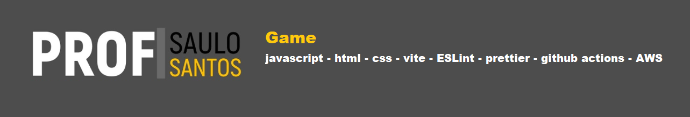

# Snake Game 🐍


Um jogo clássico da Cobrinha construído com HTML5 Canvas e Vanilla JS, modernizado com um pipeline CI/CD próprio para produção na nuvem.

## 🛠 Arquitetura e Stack
- **Linguagem:** Vanilla JS (ECMAScript Modules)
- **Bundler e Servidor Local:** Vite
- **Governança de Código:** ESLint e Prettier (Stand-alone)
- **Proteção de Commits:** Husky + lint-staged (impede "código sujo" no seu Git)
- **Integração Contínua (CI):** Testado e homologado pelo GitHub Actions via `.github/workflows/ci.yml`

## 🚀 Como Iniciar Localmente

Para rodar o jogo na sua máquina de forma otimizada (com *hot reload* na porta `:5173`):

1. **Ative o ambiente Node.js instalando as dependências:**
   ```bash
   npm install
   ```
2. **Inicie o servidor de desenvolvimento Vite:**
   ```bash
   npm run dev
   ```

> ⚠️ **Atenção:** Como o sistema modernizou a chamada do script para `type="module"`, métodos legados (como Live Server clássico, Python HTTP, ou até o duplo clique no `index.html`) podem falhar por causa das políticas de segurança avançadas dos navegadores. Sempre inicialize via *script npm*.

## 📦 Construindo para a AWS (Production Build)

Para simular exatamente o que o servidor em nuvem da AWS/Edge fará ao extrair seu código:
```bash
npm run build
```
Uma pasta intocável chamada `/dist` será gerada. Ela conterá seu código unificado, ofuscado e ultra-leve.

## 📝 Autor

**Saulo Santos**

- GitHub: [https://github.com/Prof-Saulo-Santos](https://github.com/Prof-Saulo-Santos)
- LinkedIn: [https://www.linkedin.com/in/santossaulo/](https://www.linkedin.com/in/santossaulo/)
